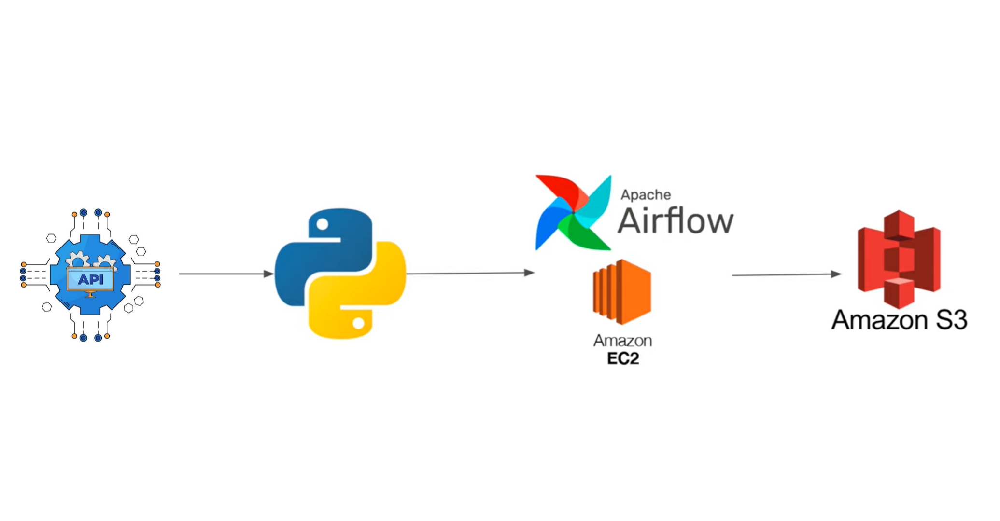
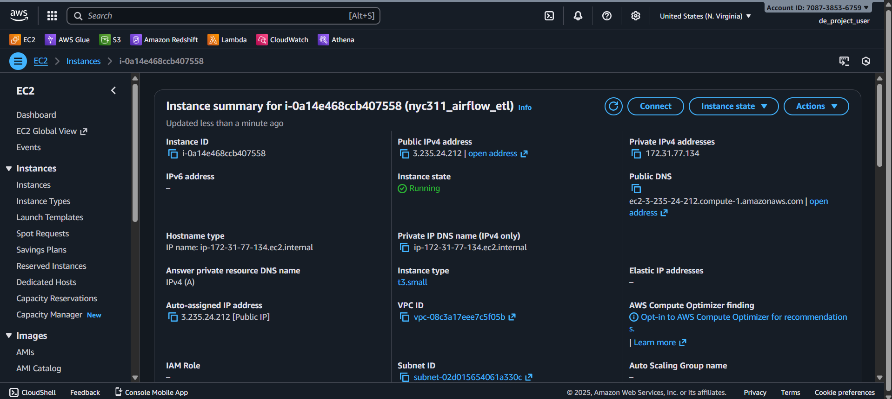
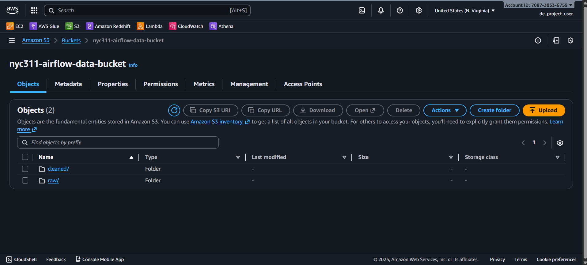
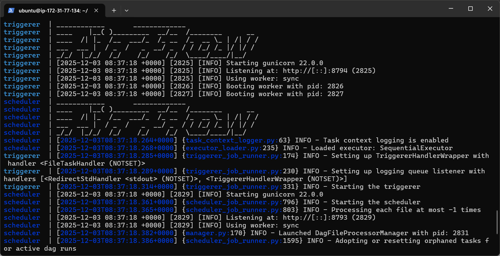
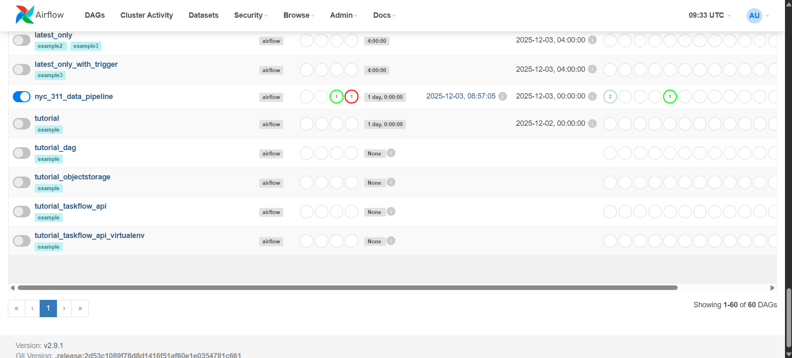
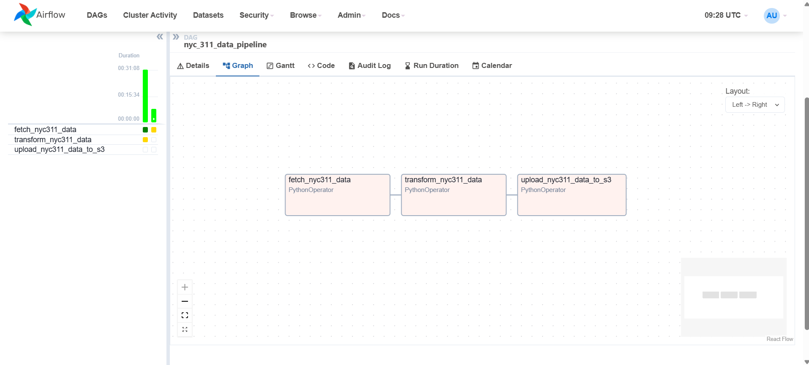
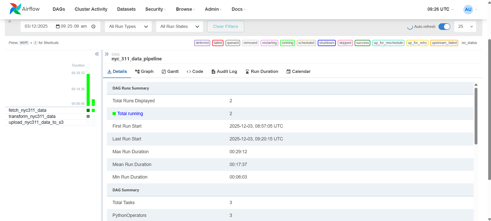

# AWS Simple Airflow Project: NYC 311 ETL Pipeline

---

## Overview

This project demonstrates a robust Data Engineering pipeline using **Apache Airflow** hosted on an **AWS EC2 (Ubuntu)** instance. The system automates the extraction, transformation, and loading (ETL) of NYC 311 Service Request data, culminating in optimized storage on **Amazon S3**.

The project focuses on setting up a standalone Airflow server on the cloud, managing dependencies, and orchestrating a Python-based data workflow.

---

## Project Goals

1.  **Cloud Infrastructure**
    Deploy and configure an **AWS EC2** instance (Ubuntu) to host the data pipeline.

2.  **Workflow Orchestration**
    Implement **Apache Airflow** to schedule and manage the ETL process.

3.  **Data Ingestion**
    Fetch large-scale public data (NYC 311) via API.

4.  **Data Transformation**
    Clean, flatten, and standardize raw JSON data into a structured format using **Pandas**.

5.  **Cloud Storage**
    Securely store processed data in **Amazon S3** in Parquet format for efficiency.

---

## Tech Stack

| Technology | Purpose |
| :--- | :--- |
|  | Virtual server for hosting Airflow and running scripts. |
|  | Workflow orchestration and scheduling. |
|  | Scalable object storage for raw and processed data. |
|  | Core programming language for ETL logic. |
|  | Data manipulation and analysis. |

---

## Architecture Diagram



---

## Dataset

-   **Source**: [NYC Open Data - 311 Service Requests](https://data.cityofnewyork.us/Social-Services/311-Service-Requests-from-2010-to-Present/erm2-nwe9)
-   **Description**: The pipeline fetches the latest 1,000,000 service requests, including details like complaint type, agency, location, and status.

---

## Project Structure

```text
aws_simple_airflow_project/
├── dags/
│   └── nyc_311_etl_dag.py    # Main Airflow DAG defining the workflow
├── scripts/
│   ├── get_nyc311_data.py    # Fetches data from NYC API
│   ├── transformations.py    # Cleans and transforms the data
│   ├── flatten_json.py       # Helper to flatten nested JSON
│   └── save_to_s3.py         # Uploads processed data to S3
├── sample_data/              # Local directory for sample data chunks
├── requirements.txt          # Python dependencies
└── README.md                 # Project documentation
```

---

## ETL Workflow

The Airflow DAG (`nyc_311_data_pipeline`) executes the following steps:

1.  **Fetch Data (`fetch_nyc311_data`)**:
    -   Connects to the NYC 311 API.
    -   Downloads 1M records as a JSON file.

2.  **Transform Data (`transform_nyc311_data`)**:
    -   Flattens nested JSON fields.
    -   Standardizes column names (snake_case).
    -   Converts data types (DateTime, Numeric).
    -   Handles missing values.
    -   Filters for relevant columns.

3.  **Upload to S3 (`upload_nyc311_data_to_s3`)**:
    -   Reads the cleaned CSV.
    -   Converts it to **Parquet** format.
    -   Uploads it to the configured S3 bucket (`nyc311-airflow-data-bucket`).

---

## Setup & Installation (Ubuntu / EC2)

Follow these steps to deploy the project on an AWS EC2 instance.

### 1. Clone the Repository
SSH into your EC2 instance and clone the repo:
```bash
git clone https://github.com/asadali27232/aws_simple_airflow_project.git
cd aws_simple_airflow_project
```

### 2. Set Up Python Environment
Create and activate a virtual environment:
```bash
sudo apt update
sudo apt install python3-venv
python3 -m venv venv
source venv/bin/activate
```

### 3. Install Dependencies
Install the required Python packages:
```bash
pip install -r requirements.txt
```

### 4. Configure Airflow
Initialize the Airflow database and create a user:
```bash
# Set Airflow Home (optional, defaults to ~/airflow)
export AIRFLOW_HOME=~/airflow

# Initialize DB
airflow db init

# Create Admin User
airflow users create \
    --username admin \
    --firstname Admin \
    --lastname User \
    --role Admin \
    --email admin@example.com
```

### 5. Start Airflow Standalone
Run the Airflow scheduler and webserver:
```bash
airflow standalone
```
Access the UI at `http://<EC2-Public-IP>:8080`.

---

## Running the DAG

1.  Copy the `dags/` folder contents to your `AIRFLOW_HOME/dags` directory (or configure `dags_folder` in `airflow.cfg` to point to this repo's `dags` folder).
2.  In the Airflow UI, unpause the **`nyc_311_data_pipeline`** DAG.
3.  Trigger the DAG manually or wait for the scheduled run.
4.  Monitor the steps in the **Graph View**.

---

## Services in Action

Below are snapshots showing the working AWS services used in this project.

<table>
  <tr>
    <td></td>
    <td></td>
    <td></td>
  </tr>
  <tr>
    <td></td>
    <td></td>
    <td></td>
  </tr>
</table>

---

## Future Enhancements

-   **Dockerization**: Containerize the Airflow setup for easier deployment.
-   **Snowflake Integration**: Load the processed data from S3 into Snowflake for analytics.
-   **Dashboarding**: Connect Power BI or Tableau to the final dataset.

---

## Let's Connect

[](https://wa.me/923074315952)
[](mailto:asadali27232@gmail.com)
[](https://www.linkedin.com/in/asadali27232/)
[](https://www.facebook.com/asadalighaffar)
[](https://twitter.com/asadali27232)
[](https://asadali27232.github.io/asadali27232)
